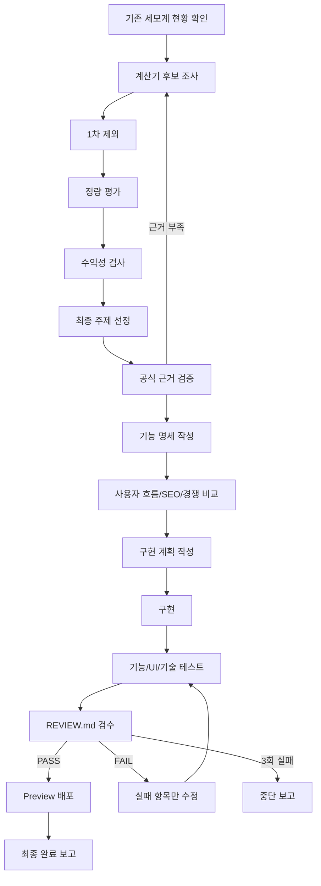

# 세모계 신규 계산기 발굴·제작·검수 반복 루프

## 목적
사람들이 실제로 많이 찾고, 공식 계산 근거가 있으며, SEO와 광고 수익 가능성이 높은 계산기를 조사·선정·구현한 뒤, `REVIEW.md` 검수 기준을 통과할 때까지 수정하는 재사용 가능한 업무 루프를 만든다.

## 사용 원칙
- 기존 세모계 계산기와 중복되거나 지나치게 유사한 주제는 제외한다.
- 블로그/경쟁 사이트의 계산식만 보고 구현하지 않는다.
- 공식 근거가 없거나 최신 기준 확인이 안 되면 중단한다.
- 결제·인증·DB 쓰기·환경변수·main 브랜치는 건드리지 않는다.
- 실패 항목만 최소 범위로 수정하고, 전체 루프를 최대 3회까지 반복한다.
- 이번 문서는 반복 실행용 압축본이며, 조사·검증 결과는 작업 산출물에 기록해 다음 반복에 재사용한다.

## 반복 루프

### 1단계. 기존 세모계 현황 확인
작업 시작 전에 다음을 확인한다.
- 현재 세모계에 존재하는 계산기 목록
- 카테고리 구조
- 기존 계산기 UI와 공통 컴포넌트
- 기존 SEO 구조
- 사용 중인 프레임워크와 배포 구조
- 최근 추가된 계산기
- 중복 제작 위험
- 수정하면 안 되는 영역

기존 계산기와 동일하거나 지나치게 유사한 후보는 제외한다.

### 2단계. 사용자 문제 및 계산 수요 조사
다음 경로에서 사람들이 실제로 자주 묻는 계산 문제를 조사한다.
- Google 검색
- 네이버 검색
- 검색 자동완성
- 관련 검색어
- 커뮤니티 질문
- 블로그·카페·지식인
- 경쟁 계산기 사이트
- 공공기관 FAQ
- 생활·급여·세금·건강·금융·자영업 관련 반복 질문

조사 결과에서 최소 10개의 계산기 후보를 수집한다.

각 후보마다 다음을 기록한다.
- 계산기 이름
- 사용자가 실제로 검색할 문장
- 해결하려는 문제
- 예상 사용자
- 검색 의도
- 예상 사용 빈도
- 관련 키워드
- 기존 세모계 중복 여부

### 3단계. 후보 1차 제외
다음 조건에 해당하는 후보는 즉시 제외한다.
- 기존 세모계 계산기와 중복
- 단순 정보 제공만 필요하고 계산 기능이 불필요함
- 계산식이 존재하지 않음
- 공식 근거 확보가 어려움
- 결과 오해 시 사용자 피해 가능성이 큼
- 의료·법률·세무 판단을 단정적으로 제공해야 함
- 입력값 대비 결과 가치가 낮음
- 검색 의도가 지나치게 모호함
- 일회성 유행에 가까움
- 애드센스 또는 광고 정책상 위험 가능성이 큼

1차 제외 후 후보를 최소 5개 남긴다.

### 4단계. 후보 정량 평가
남은 후보를 아래 기준으로 각각 10점 만점으로 평가한다.
1. 검색 수요
2. 장기 검색 지속성
3. 경쟁 강도
4. 상위 콘텐츠 개선 가능성
5. 공식 계산식 존재 여부
6. 계산 결과 검증 가능성
7. 사용자 문제 해결력
8. 반복 사용 가능성
9. 세모계 기존 카테고리 적합성
10. 관련 계산기 확장성
11. 내부링크 가능성
12. 콘텐츠 확장 가능성
13. 광고 친화성
14. 예상 CPC 또는 광고 수익 가능성
15. 수익형 키워드와의 연관성
16. 차별화 가능성
17. 모바일 사용 적합성
18. 구현 난이도 대비 가치
19. 법률·세금·제도 변경 위험
20. 장기 유지보수 난이도

총점은 200점 만점으로 계산한다.

점수 해석:
- 160점 이상: 우선 제작 후보
- 140~159점: 보완 검토 후 제작 가능
- 120~139점: 보류
- 120점 미만: 제외

단, 공식 계산 근거 점수가 7점 미만이면 총점과 무관하게 제외한다.

### 5단계. 수익성 검사
각 후보에 대해 다음을 별도로 분석한다.
- 검색량 또는 검색 수요 신호
- 광고가 많이 붙는 분야인지
- 금융·급여·세금·사업·보험·부동산 등 고가치 키워드 연관성
- 애드센스 정책상 안전성
- 결과 페이지 체류시간을 늘릴 수 있는지
- 관련 정보 콘텐츠 확장 가능성
- 관련 계산기 3개 이상으로 확장 가능한지
- 내부링크 허브 역할이 가능한지
- 재방문 가능성이 있는지
- 이메일 수집·PDF 저장·리포트 기능 등 향후 유료 기능 연결 가능성
- 자영업자·근로자·부모·건강 관심층 등 명확한 타깃이 있는지
- 시즌성 또는 제도 변경에 따른 트래픽 상승 가능성
- 광고 외 수익모델 연결 가능성

수익성 평가는 다음 등급으로 분류한다.
- A: 높은 검색 수요 + 높은 광고/확장 가능성
- B: 안정적인 검색 수요 + 중간 수익성
- C: 사용자 가치는 있으나 수익성 낮음
- D: 제작 우선순위 낮음

최종 선정은 원칙적으로 A 또는 B 등급 중에서만 한다.

### 6단계. 최종 주제 선정
후보 평가표를 작성하고 최종 계산기 1개를 선정한다.

최종 보고에는 반드시 다음을 포함한다.
- 최종 선정 계산기명
- 선정 점수
- 수익성 등급
- 선정 이유
- 제외된 주요 후보와 제외 이유
- 예상 주요 키워드
- 예상 사용자
- 관련 계산기 확장 아이디어
- 세모계에 추가했을 때의 기대 효과

선정 근거가 약하거나 A/B 등급 후보가 없으면 2단계로 돌아가 다시 조사한다.

### 7단계. 공식 계산 근거 검증
구현 전에 계산식의 신뢰성을 검증한다.

출처 우선순위:
1. 법령·정부·공공기관
2. 국가 통계·공식 고시
3. 공신력 있는 전문기관
4. 공식 제품·서비스 문서
5. 검증 가능한 학술·전문 자료

블로그나 경쟁 사이트의 계산식만 보고 구현하지 않는다.

정리할 내용:
- 계산 공식
- 변수 정의
- 단위
- 반올림 규칙
- 최소·최대값
- 적용 대상
- 제외 대상
- 예외 조건
- 기준일
- 법령·제도 변경 가능성
- 사용자가 오해할 수 있는 지점
- 면책 문구 필요 여부

공식 근거가 충돌하면 구현을 중단하고 보고한다.
공식 근거를 확보하지 못하면 후보를 폐기하고 2단계로 돌아간다.

### 8단계. 계산기 기능 명세 작성
구현 전에 다음 명세를 작성한다.
- 계산기 이름
- 한 줄 설명
- 입력값
- 필수 입력값
- 선택 입력값
- 출력값
- 계산 공식
- 단위
- 입력 제한
- 오류 메시지
- 초기값
- 예제 입력
- 예제 출력
- 결과 해석
- 주의사항
- 면책 문구
- 관련 계산기 추천
- 공유 기능 필요 여부
- PDF·이미지·엑셀 저장 확장 가능성

### 9단계. 사용자 흐름 설계
사용자가 5초 안에 무엇을 계산하는 페이지인지 이해할 수 있게 설계한다.

기본 흐름:
1. 계산기 목적 확인
2. 입력값 입력
3. 계산 버튼 클릭
4. 핵심 결과 확인
5. 세부 계산 내역 확인
6. 결과 해석 확인
7. 관련 계산기 이동

지켜야 할 조건:
- 모바일 우선
- 입력칸 최소화
- 전문용어 최소화
- 필수값과 선택값 구분
- 결과 숫자를 가장 크게 표시
- 천 단위 구분
- 단위 명확히 표시
- 과도한 애니메이션 금지
- 결과를 색상만으로 구분하지 않기
- 접근성 고려
- 기존 세모계 UI와 일관성 유지

### 10단계. SEO 설계
다음을 작성한다.
- 메인 키워드
- 보조 키워드
- 롱테일 키워드
- 검색 의도
- SEO title
- meta description
- H1
- URL slug
- 소개 문구
- 계산 방법 설명
- 사용 예시
- FAQ 최소 5개
- 관련 계산기 내부링크
- 관련 블로그 글 아이디어
- 구조화 데이터 적용 여부
- Open Graph 문구
- 검색 결과에서 클릭을 유도할 핵심 문구

키워드 반복은 피하고 자연스럽게 작성한다.

### 11단계. 경쟁 페이지 비교
상위 경쟁 페이지 최소 3개를 확인하고 다음을 비교한다.
- 입력 항목 수
- 결과 표시 방식
- 모바일 편의성
- 계산식 설명 여부
- 공식 출처 표시 여부
- FAQ 존재 여부
- 내부링크 구조
- 광고 배치
- 결과 활용 기능
- 부족한 점
- 세모계가 더 잘할 수 있는 점

최소 3개의 차별화 요소를 정의한다.

예:
- 계산 근거 표시
- 결과 세부 내역 제공
- 모바일 UX 개선
- 더 쉬운 설명
- 관련 계산기 추천
- 결과 저장
- 기준일 표시
- 예제 계산 제공

### 12단계. 구현 계획 작성
코드를 수정하기 전에 다음을 보고한다.
- 수정할 파일
- 새로 만들 파일
- 재사용할 컴포넌트
- 계산 로직 위치
- 테스트 파일
- 예상 위험
- 롤백 방법

안전 규칙:
- main 브랜치 직접 수정 금지
- 별도 브랜치에서 작업
- 결제 코드 수정 금지
- 인증·세션 수정 금지
- DB 쓰기 로직 수정 금지
- 환경변수 수정 금지
- API 키·secret 노출 금지
- 기존 파일 대량 삭제 금지
- 기존 계산기 공통 기능 손상 금지
- 변경 전 백업 또는 Git 상태 확인

### 13단계. 계산기 구현
다음 순서로 구현한다.
1. 계산 로직 함수 작성
2. 입력 검증 작성
3. UI 입력 폼 작성
4. 결과 카드 작성
5. 세부 계산 내역 작성
6. 설명·공식 출처 작성
7. FAQ 작성
8. 관련 계산기 내부링크 추가
9. SEO 메타데이터 추가
10. 모바일 레이아웃 적용
11. 접근성 속성 확인
12. 오류 상태 처리

가능한 경우 계산 로직과 UI를 분리한다.

### 14단계. 기능 테스트
최소 다음 테스트 케이스를 수행한다.
- 정상값
- 최소값
- 최대값
- 0
- 음수
- 빈 입력
- 숫자가 아닌 입력
- 소수점
- 매우 큰 값
- 경계값
- 단위 변경
- 선택값 미입력
- 공식 예제값
- 수기 계산값 비교

모든 테스트 결과를 표로 기록한다.

### 15단계. 계산 결과 교차 검증
계산 결과는 최소 2가지 방식으로 검증한다.
- 공식 예제 또는 공공기관 자료와 비교
- 수기 계산 또는 별도 검증 코드와 비교

경쟁 사이트 결과는 참고만 하고 정답 근거로 사용하지 않는다.

결과가 다르면 원인을 분석한다.
- 공식 차이
- 반올림 차이
- 기준연도 차이
- 입력 조건 차이
- 구현 오류

오류 원인을 확인하지 못하면 완료 처리하지 않는다.

### 16단계. UI/UX 테스트
다음을 확인한다.
- 모바일 화면
- 데스크톱 화면
- 작은 화면
- 긴 숫자 표시
- 긴 문구 표시
- 입력 오류 상태
- 버튼 크기
- 글자 크기
- 결과 가독성
- 가로 스크롤 발생 여부
- 레이아웃 깨짐 여부
- 색상 대비
- 키보드 입력 가능 여부

### 17단계. 기술 테스트
다음을 확인한다.
- 빌드 성공
- 타입 오류 없음
- 콘솔 오류 없음
- 런타임 오류 없음
- 링크 오류 없음
- 기존 계산기 정상
- 기존 페이지 회귀 오류 없음
- 불필요한 패키지 추가 없음
- 성능 저하 없음
- 모바일 Core Web Vitals에 심각한 문제 없음

### 18단계. REVIEW.md 검수
`REVIEW.md`의 모든 항목을 검사한다.

검수 결과는 반드시 다음 형식으로 기록한다.
- PASS
- FAIL
- 보류
- 사용자 확인 필요

하나라도 FAIL이면 완료 처리하지 않는다.

### 19단계. 수정 루프
FAIL이 발생하면 다음 방식으로 반복한다.
1. 실패 항목 기록
2. 실패 원인 분석
3. 관련 단계로 돌아가기
4. 최소 범위 수정
5. 해당 테스트 재실행
6. 전체 회귀 테스트
7. REVIEW.md 재검수

최대 3회 반복한다.

반복 기록 형식:
- Iteration 1
- 실패 항목
- 수정 내용
- 재검사 결과

- Iteration 2
- 실패 항목
- 수정 내용
- 재검사 결과

- Iteration 3
- 실패 항목
- 수정 내용
- 재검사 결과

3회 반복 후에도 FAIL이면 작업을 중단하고 사용자에게 보고한다.

### 20단계. 중단 조건
다음 상황에서는 즉시 작업을 중단한다.
- 공식 계산 근거 없음
- 출처 간 계산식 충돌
- 최신 법령·세율·기준 확인 불가
- 의료·법률 판단 위험
- 기존 서비스 손상 가능성
- 결제·인증·DB·환경변수 수정 필요
- main 브랜치 직접 수정 필요
- 3회 수정 후에도 테스트 실패
- 배포 실패 원인 확인 불가
- 사용자 승인이 필요한 위험 변경 발생

중단 시에도 무응답으로 끝내지 말고 다음 형식으로 보고한다.
[상태]
[한 일]
[막힌 이유]
[현재 결과]
[필요한 사용자 결정]
[다음 단계]

### 21단계. Preview 배포
모든 검수가 PASS일 때만 다음을 진행한다.
- 별도 Git 브랜치 생성
- 변경 파일 확인
- 커밋
- 원격 브랜치 push
- Vercel Preview 생성
- Preview URL 확인
- 모바일·PC 최종 확인

main 병합과 프로덕션 배포는 사용자 승인 전까지 금지한다.

### 22단계. 최종 완료 보고
최종 보고에는 다음을 반드시 포함한다.
1. 최종 계산기명
2. 선정 이유
3. 후보 비교표
4. 수익성 평가 결과
5. 수익성 등급
6. 예상 주요 키워드
7. 공식 계산 근거
8. 계산 공식
9. 기준일
10. 변경 파일 목록
11. 테스트 케이스
12. 테스트 결과
13. REVIEW.md 최종 결과
14. 수정 반복 횟수
15. Preview URL
16. 관련 계산기 확장 아이디어
17. 향후 유료 기능 연결 가능성
18. 남아 있는 위험요소
19. main 병합 여부
20. 다음 추천 작업

최종 상태는 반드시 다음 중 하나로 표시한다.
- 완료
- 부분 완료
- 실패
- 사용자 확인 필요

## 반복 실행용 순서도

## 제출용 요약문
이 문서는 세모계의 신규 계산기를 반복적으로 발굴·평가·구현·검수하기 위한 재사용 루프입니다. 검색 수요, 공식 근거, 수익성, SEO, 사용자 가치, 유지보수성을 함께 평가하고, `REVIEW.md` 기준을 통과할 때만 완료하도록 설계했습니다. 앞으로 새 계산기를 만들 때는 이 문서를 기준으로 후보 조사부터 Preview 배포까지 같은 절차를 반복하면 됩니다.
